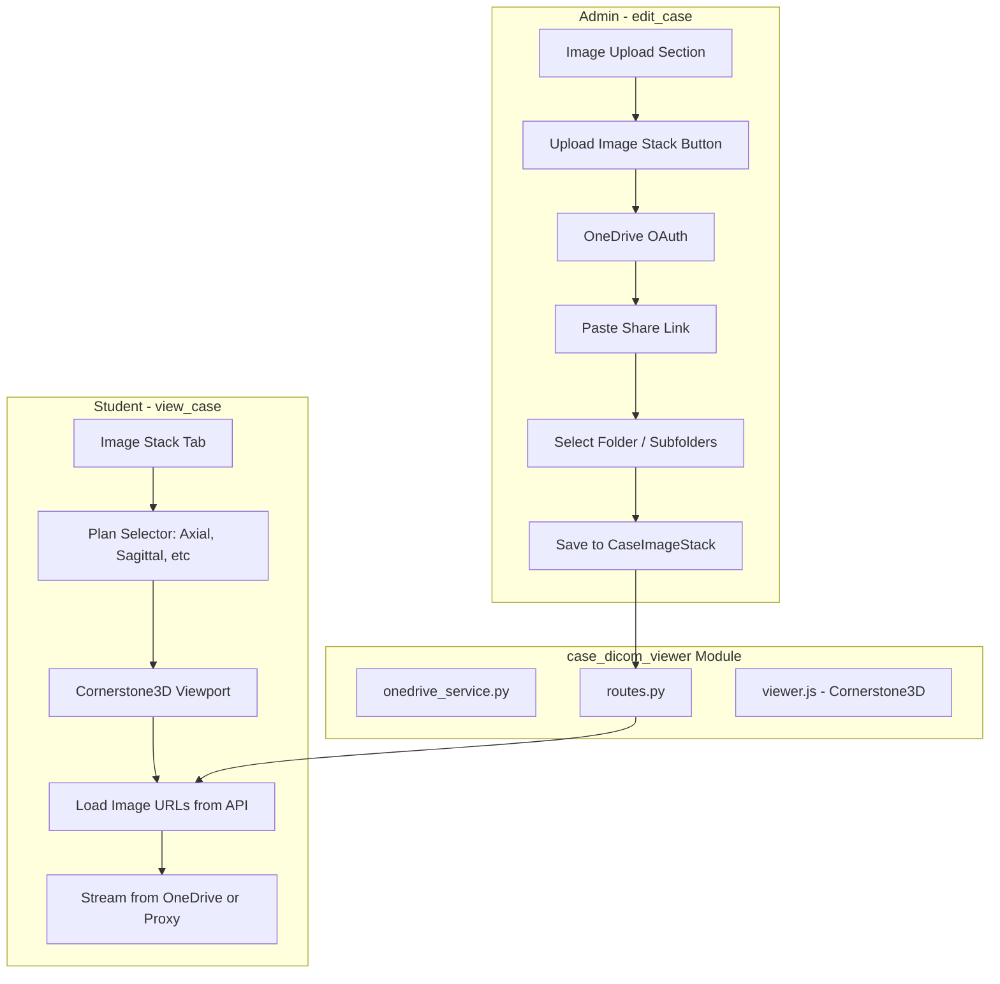

# Case DICOM Viewer - Implementation Plan

> **Priority:** 7 (Content Enhancement)  
> **Complexity:** Medium-High  
> **Estimated Effort:** ~12 days  
> **Status:** Planned  
> **Branch:** `feature/case-dicom-viewer`

## Overview

Build a **standalone, exportable module** (`case_dicom_viewer`) that:

1. **OneDrive integration:** Admin OAuth login, paste share link to folder, list subfolders (axial, sagittal, etc.)
2. **Cornerstone3D viewer:** DICOM-like image stack display with plan selection and slice scrolling
3. **Integration:** Admin adds image stack in `edit_case`; students view in `view_case` sidebar tab

Images remain in OneDrive; viewer streams via direct URLs or backend proxy. All work on branch `feature/case-dicom-viewer`.

---

## Architecture



---

## Module Structure (Standalone, Exportable)

```
case_dicom_viewer/
├── __init__.py           # Exports: get_blueprint, init_app
├── config.py             # Azure app ID, scopes; env vars
├── onedrive_service.py   # OAuth, Graph API, folder listing, share link parsing
├── routes.py             # Flask Blueprint: OAuth callbacks, API endpoints
├── models.py             # CaseImageStack, CaseImageStackPlan (optional: in main models.py with FK)
├── static/
│   └── case_dicom_viewer/
│       ├── viewer.js     # Cornerstone3D init, stack load, tools
│       └── viewer.css    # Scoped styles (brand colors)
├── templates/
│   └── case_dicom_viewer/
│       ├── admin_link_modal.html   # OneDrive connect + paste link UI
│       └── viewer_component.html   # Reusable viewer partial (plan tabs + viewport)
└── docs/
    └── EXPORT_GUIDE.md   # How to copy module to another app
```

**Reusability:** Module uses `get_blueprint()` and `init_app(app)` pattern like `ajcc_tnm`. No direct imports of app-specific models; optional adapter layer for Case/User.

---

## Part A: OneDrive Integration

### A.1 Azure App Registration

- Create app in Azure Portal (free)
- Redirect URI: `{APP_URL}/case-dicom-viewer/oauth/callback`
- API permissions: `Files.Read`, `Files.Read.All`, `User.Read` (delegated)
- Store `AZURE_CLIENT_ID`, `AZURE_CLIENT_SECRET` in `.env`

### A.2 OAuth Flow

- **Login:** Admin clicks "Link OneDrive Folder" in edit_case
- Modal opens; "Connect OneDrive" triggers OAuth
- Callback stores tokens in session (or User model column `onedrive_tokens` JSON)
- Token refresh via MSAL or manual refresh_token flow

### A.3 Share Link Parsing

- Admin pastes OneDrive share link (e.g. `https://1drv.ms/...` or `https://onedrive.live.com/...`)
- Use Graph API: `shares/{encodedShareId}/driveItem/children` to list folder contents
- Share ID extraction: [Microsoft docs](https://learn.microsoft.com/en-us/onedrive/developer/rest-api/resources/sharinglink)
- List subfolders (axial, sagittal, coronal, etc.) and image files (JPEG) per subfolder

### A.4 API Endpoints (module routes)

| Method | Path                   | Purpose                                           |
| ------ | ---------------------- | ------------------------------------------------- |
| GET    | `/oauth/authorize`     | Redirect to Microsoft login                       |
| GET    | `/oauth/callback`      | Handle OAuth callback, store tokens               |
| POST   | `/api/folder/parse`    | Parse share link, return folder tree + image URLs |
| GET    | `/api/case/{id}/stack` | Return image stack config for case (student view) |
| POST   | `/api/case/{id}/stack` | Save stack config (admin)                         |

### A.5 Database Schema

Add to `models.py` or module-owned models:

```python
class CaseImageStack(db.Model):
    """OneDrive-linked image stack for a case"""
    __tablename__ = 'case_image_stack'
    id = db.Column(db.Integer, primary_key=True)
    case_id = db.Column(db.Integer, db.ForeignKey('case.id'), nullable=False, unique=True)
    onedrive_share_id = db.Column(db.String(500), nullable=False)  # Encoded share ID
    onedrive_folder_path = db.Column(db.String(500), nullable=True)  # Optional path
    config_json = db.Column(db.JSON, nullable=False)  # { "axial": [url1, url2], "sagittal": [...] }
    created_by_user_id = db.Column(db.Integer, db.ForeignKey('user.id'), nullable=True)
    created_at = db.Column(db.DateTime, default=datetime.utcnow)
```

---

## Part B: Cornerstone3D Viewer

### B.1 Dependencies

- `@cornerstonejs/core`
- `@cornerstonejs/tools`
- `cornerstone-web-image-loader` (for JPEG/PNG)

Load via CDN or bundle; keep in module `static/` if bundled.

### B.2 Viewer Component

- **Plan tabs:** Axial, Sagittal, Coronal (or dynamic from config)
- **Stack viewport:** One viewport per plan; `setStack(imageIds, index)`
- **Tools:** StackScroll (mouse wheel), Zoom, Pan, WindowLevel
- **imageIds:** Array of URLs (OneDrive direct or proxy URLs)

### B.3 Image URL Handling

- **Option 1 (preferred):** Backend proxy endpoint `/case-dicom-viewer/api/image?url=...` fetches from OneDrive and streams (avoids CORS, handles auth)
- **Option 2:** Use OneDrive embed URLs if they allow cross-origin (may have expiry)

### B.4 Viewer Initialization (Reusable)

```javascript
// Export for other apps
window.CaseDicomViewer = {
  init(containerId, stackConfig) { ... },
  loadStack(planName, imageUrls) { ... },
  destroy() { ... }
};
```

---

## Integration Points

### edit_case.html

- **Location:** Section 4 (Case Images), after Upload form
- **Add:** "Upload Image Stack" button (styled like existing Upload button)
- **Action:** Open modal (include `admin_link_modal.html`) for OneDrive connect + paste link
- **Style:** Card with header `linear-gradient(135deg, #17a2b8 0%, #138496 100%)` to match Images section

### view_case.html

- **Location:** Sidebar tabs (after TCIA, before or after RadiologyAssistant)
- **Add tab:** "Image Stack" (`id="imageStackTab"`, `data-bs-target="#imageStackPane"`)
- **Tab content:** Include `viewer_component.html` when case has `CaseImageStack`; else "No image stack for this case"
- **Icon:** `fa-layer-group` or `fa-images`; color `#17a2b8` (info blue)

---

## Style and Branding Alignment

Follow `docs/STYLE_GUIDE.md` and `docs/plans/MASTER_PLANNING_INDEX.md`:

| Element              | Value                                             |
| -------------------- | ------------------------------------------------- |
| Primary actions      | `#e96304` (Peachy Orange) or `#5E899E` (Teal)     |
| Info / viewer accent | `#17a2b8`                                         |
| Success (connected)  | `#28a745`                                         |
| Cards                | `border: 1px solid #c5cad1`, `border-radius: 8px` |
| Buttons              | Bootstrap 5 `btn`, `btn-info`, `btn-outline-*`    |
| Icons                | FontAwesome 5                                     |
| Console prefix       | `[CaseDicomViewer]`                               |

---

## Implementation Phases

| Phase                      | Tasks                                                           | Est. Days |
| -------------------------- | --------------------------------------------------------------- | --------- |
| 1. Branch and skeleton     | Create `feature/case-dicom-viewer`, folder structure, blueprint | 0.5       |
| 2. OneDrive OAuth          | Azure app, OAuth flow, token storage                            | 2         |
| 3. Folder listing          | Share link parse, Graph API, folder tree + image URLs           | 2         |
| 4. Database and API        | CaseImageStack model, migration, CRUD routes                    | 1         |
| 5. Admin UI                | edit_case button, modal, save stack                             | 1.5       |
| 6. Cornerstone3D viewer    | viewer.js, Web Image Loader, stack viewport, tools              | 2         |
| 7. view_case tab           | Tab, viewer component, load stack from API                      | 1         |
| 8. Image proxy (if needed) | Backend proxy for OneDrive URLs                                 | 1         |
| 9. Style pass and testing  | Brand alignment, error states, logging                          | 1         |

**Total:** ~12 days

---

## Files to Create

| File                                                                  | Purpose                         |
| --------------------------------------------------------------------- | ------------------------------- |
| `case_dicom_viewer/__init__.py`                                       | Blueprint export, init_app      |
| `case_dicom_viewer/config.py`                                         | Azure config, env vars          |
| `case_dicom_viewer/onedrive_service.py`                               | OAuth, Graph API, share parsing |
| `case_dicom_viewer/routes.py`                                         | Blueprint, OAuth + API routes   |
| `case_dicom_viewer/static/case_dicom_viewer/viewer.js`                | Cornerstone3D viewer            |
| `case_dicom_viewer/static/case_dicom_viewer/viewer.css`               | Scoped styles                   |
| `case_dicom_viewer/templates/case_dicom_viewer/admin_link_modal.html` | OneDrive link UI                |
| `case_dicom_viewer/templates/case_dicom_viewer/viewer_component.html` | Viewer partial                  |
| `case_dicom_viewer/docs/EXPORT_GUIDE.md`                              | Reusability guide               |
| `migrations/versions/xxx_add_case_image_stack.py`                     | Migration                       |

## Files to Modify

| File                           | Change                                          |
| ------------------------------ | ----------------------------------------------- |
| `app.py`                       | Register blueprint, init                        |
| `models.py`                    | Add CaseImageStack (or reference module models) |
| `templates/edit_case.html`     | Add "Upload Image Stack" button, modal include  |
| `templates/view_case.html`     | Add Image Stack tab and pane                    |
| `.env.example`                 | AZURE_CLIENT_ID, AZURE_CLIENT_SECRET            |
| `docs/plans/MASTER_PLANNING_INDEX.md` | Add plan entry                          |

---

## Success Criteria

- Admin can connect OneDrive, paste share link, select folder; stack saved to case
- Student sees Image Stack tab when stack exists; can select plan and scroll slices
- Full definitions visible in viewer; zoom, pan, window/level work
- Module is self-contained and documented for export
- All UI matches app style guide
- All work on `feature/case-dicom-viewer` branch
