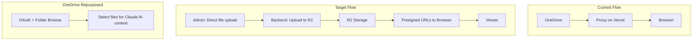

# R2 Migration and Viewer Upgrade Plan

> **Priority:** 9 (Case DICOM Viewer Upgrade)  
> **Complexity:** Medium-High  
> **Estimated Effort:** 4-5 weeks  
> **Status:** Planned  
> **Depends on:** Plan 7 (Case DICOM Viewer) – Implemented

---

## Executive Summary

Migrate case image stacks from OneDrive to Cloudflare R2, upgrade the DICOM viewer for smooth plan switching and session-long caching, and repurpose OneDrive for folder browsing to support Claude AI context. **Start fresh:** delete all existing stacks; new stacks are uploaded directly to R2 (no OneDrive migration).

**Hierarchy:** Case → Study (0 or more) → Series (1 or more per study). In the UI, "stack" is renamed to **study**; each study has an admin-defined label, optional description, and one or more series (e.g. axial, coronal, T1 axial). Admins can add/remove series within a study and remove studies from a case.

**Cleanup rule:** The app never deletes from R2. Removing a study or series only unlinks from the DB. Storage cleanup is done via Admin → R2 Bucket Manager.

**View-case UI:** When multiple studies exist, show a **single viewer** with a **study selector** (dropdown or tabs) so admin/student chooses which study to view—not multiple viewers at once. All UI changes must follow app style and branding.

---

## Style and Branding Requirements

**All implementations MUST follow existing app design patterns.**

### Color Palette

| Name | Hex | Usage |
|------|-----|-------|
| Peachy Orange | `#e96304` | Primary buttons, accents, CTAs |
| Soft Green | `#a8d5ba` | Success states, secondary buttons |
| Teal Blue | `#5E899E` | Headers, neutral actions, nav |
| Info Blue | `#17a2b8` | Hints, explanations |
| Bootstrap Yellow | `#ffc107` | Warnings, highlights |
| Danger Red | `#dc3545` | Errors |

Text: Primary `#2c3e50`, Secondary `#5a6270`, Muted `#8b94a3`. Backgrounds: White `#ffffff`, Off-white `#fdfdfb`, Border `#c5cad1`.

### Fonts

Use app typography: `-apple-system`, `BlinkMacSystemFont`, `'Segoe UI'`, `Roboto`, sans-serif for body; monospace for code/notes where applicable.

### Modals

**Do not use Bootstrap modals where Vue modals are needed.** Use Vue-based modals for new modal dialogs; follow existing modal patterns in the app.

### Image Viewer and Study Selector

**Use the existing stack image viewer.** Changes are limited to internal logic (preload, Cornerstone cache, re-init on study change) in `viewer.js`. Do not alter the viewer component structure or layout. **New UI** (e.g. study selector dropdown/tabs in view_case) must follow app style (color palette, fonts, existing dropdown/tab patterns).

### Branch and Version Control

- **All work MUST be done in a new feature branch** (e.g. `feature/r2-migration-viewer-upgrade`). Do not commit directly to `main`.
- **Commit and push reasonably** – small, logical commits with clear messages. Push frequently so work is backed up.
- **Preserve main** – Do not merge to `main` or overwrite the current state of the app in `main` unless explicitly confirmed by the project owner. The state of `main` must not be lost without confirmation.

---

## Architecture



---

## Part A: Cloudflare R2 Migration

### A.1 R2 Setup

- Create R2 bucket in Cloudflare dashboard
- Configure CORS for app origin (e.g. `https://your-app.vercel.app`, `http://localhost:5000`)
- Set Cache-Control headers for immutable URLs if using public access
- Store credentials: `R2_ACCOUNT_ID`, `R2_ACCESS_KEY_ID`, `R2_SECRET_ACCESS_KEY`, `R2_BUCKET_NAME`

### A.2 Data Model Changes

Add to `CaseImageStack` (migration) — **CaseImageStack = Study** in UI:

| Column | Type | Purpose |
|--------|------|---------|
| `study_label` | VARCHAR | Admin-defined label for the study (mandatory; e.g. "CT temporal bone") |
| `storage_backend` | VARCHAR | `'r2'` or `'onedrive'` (legacy, to be removed) |
| `r2_config_json` | JSON | `{ "axial": ["key1", "key2"], "sagittal": [...] }` – R2 object keys per series |
| `display_order` | INTEGER | Order of studies when multiple per case (0 = first) |
| `description_html` | TEXT | Rich-text description per study (TinyMCE) |
| Remove `UNIQUE` on `case_id` | - | Allow multiple studies per case |

For new R2-only stacks: `storage_backend = 'r2'`, `r2_config_json` holds object keys per series. Legacy OneDrive columns remain but are no longer used for image display.

### A.3 Admin UI: Direct Upload to R2

**Flow (no OneDrive migration):**

1. Delete all existing case image stacks (start fresh)
2. Admin in `edit_case` clicks "Add Study" (or "Add Image Study")
3. Admin creates new study (custom label) or selects existing study
4. Admin adds series (custom names: axial, T1 axial, axial contrast, etc.) via file picker or folder selection
5. Backend receives multipart upload, stores each file in R2 with human-readable path pattern
6. Backend creates/updates `CaseImageStack` (study) with `r2_config_json` containing R2 object keys per series
7. Admin can add more series to existing study or add new studies

### A.4 URL Generation

| Option | Link Lifetime | User Access | Recommendation |
|--------|---------------|-------------|----------------|
| **Public** | No expiry | Same URL always | Use if URLs are non-guessable (e.g. random paths) |
| **Presigned** | 24-48h | New URL generated when user loads case | Use for private bucket; backend returns fresh URLs in stack API |

**Presigned flow:** When user opens a case, `GET /api/case/{id}/stack` returns image URLs. Backend generates presigned URLs (e.g. 48h) for each R2 object. User loads case -> gets fresh URLs. On next visit, same API call returns new presigned URLs. No expiry concern for normal usage.

### A.5 Remove Proxy and OneDrive Image Linking

- Remove `proxy_image` route
- Remove `imageStackProxyUrl()` in `view_case.html`
- Frontend uses direct R2 URLs (public or from stack API)
- Remove OneDrive-based stack save flow from `edit_case`; replace with "Upload to R2" flow

---

## Part B: Viewer Upgrades

**Constraint:** Do not alter the existing stack image viewer component or UI. Changes are internal logic only.

### B.1 Preload Cancellation on Plan Switch

When user switches plan (e.g. Axial -> Sagittal), stop loading images for the previous plan.

- Add `_preloadRunId` in `viewer.js`; increment on each `loadStack` / plan switch
- In `preloadFullStack()` and `preloadImages()`, capture runId at start; on completion, if `runId !== _preloadRunId`, ignore result
- Only the active plan's preload affects the UI

### B.2 Cornerstone Cache Size

- Call `cornerstone.imageLoader.imageCache.setMaximumSizeBytes(2 * 1024 * 1024 * 1024)` (2 GB) after Cornerstone init
- Enables session-long retention of multiple plans (e.g. 240 MB/case x several plans)

### B.3 Session Cache Retention

- Keep `_preloadedImages` global; do not clear on plan switch
- Only clear on `disable()` (viewer teardown)
- Returned-to plans use cached images when available

### B.4 Reduce Plan-Switch Delay

- Reduce or remove the 100ms delay before `preloadFullStack()` on plan switch (currently in `loadStack` setTimeout)
- Consider 0ms or 50ms to make plan switching feel more responsive

### B.5 Center-First Preload Order (Black Slice Heuristic)

- Preload from center outward: center slice first, then center±1, center±2, etc.
- Slices with actual anatomy (typically toward center) load before black/empty edge slices
- Improves perceived smoothness when scrolling through the stack

---

## Part C: OneDrive Repurposing

**Purpose change:** From image linking to folder browsing for AI context.

**Use case:** User browses OneDrive folders, selects files to provide to Claude AI for richer responses (guidelines, notes, study materials).

**Keep:**

- OAuth flow, token storage
- `onedrive_service.py`: `list_folder_contents`, share link parsing, file download

**Remove from image flow:**

- `CaseImageStack` no longer stores `onedrive_share_id` for serving images (R2 only)

**New (future, with AI/RAG plan):**

- OneDrive folder browser UI: list files, select files
- "Add to AI context" – backend fetches file content, passes to Claude API
- Integration with Plan 6 (AI/RAG Knowledge System)

---

## Part F: Bug Fixes and UX Improvements

### F.1 Image Stack Link Two-Attempt Save

**Issue:** Linking image stack sometimes requires two attempts; first attempt appears saved but nothing persists when case is saved.

**Cause:** For new cases, the flow redirects to view-case after case save. User leaves the edit page before they can link the stack. Stack linking only works on edit-case with a valid case ID.

**Fixes:**

- After creating a new case, redirect to `edit-case?id={newId}` instead of `view-case`, so the user can link the stack in the same session
- Or show a clear message after case creation: "Case saved. You can now link an Image Stack"

**Files:** `static/edit-case-modal.js` (redirect logic after case create)

### F.2 Plan Switching Delay

**Issue:** Noticeable delay when switching plans; downloads do not shift quickly to the new plan.

**Cause:** 100ms delay before preloadFullStack; first image of new plan must load before view updates; conservative batching (4 images, 150ms).

**Fixes:**

- Reduce or remove the 100ms delay before `preloadFullStack()` on plan switch (see B.4)
- Prioritize visible slice and nearby slices in preload order

### F.3 Center-First Preload (Black Slice Heuristic)

**Issue:** Black/empty slices (outside patient body) load with same priority as slices with actual anatomy.

**Fix:** Preload from center outward – center slice first, then center±1, center±2, etc. Slices with content load sooner (see B.5).

**Future (R2 migration):** Server-side analysis during upload to detect non-black slices; store metadata in `r2_config_json` for prioritized loading.

---

## Part G: Case → Study → Series Hierarchy

**All UI in this section must follow app style and branding** (color palette, fonts, existing modal/button patterns).

### G.1 Terminology and Structure

| Term | Meaning |
|------|---------|
| **Case** | A clinical case (existing entity) |
| **Study** | One image set within a case (DB: `CaseImageStack`). Admin-defined label (e.g. "CT temporal bone", "MRI brain") |
| **Series** | One named image sequence within a study (e.g. axial, coronal, T1 axial). Multiple series per study |

### G.2 R2 Storage Pattern

Human-readable paths for recognition in the R2 bucket:

```
cases/{case_id}_{sanitized_case_title}/studies/{study_id}_{sanitized_study_label}/{series_slug}/{index:04d}.{ext}
```

Example: `cases/5_temporal_bone_ct/studies/12_ct_scan/axial/0000.jpg`

- **case_slug**: `case_id` + sanitized case title (recognition)
- **study_slug**: `study_id` + sanitized `study_label` (recognition)
- **series_slug**: sanitized series name (e.g. `axial`, `axial_contrast`)
- **Files**: `0000.jpg`, `0001.jpg`, … in **original filename sort order** (stable indices for annotations)

### G.3 Duplicate Study Names

- **Allow** duplicate study labels within the same case (e.g. two "CT scan" studies if needed)
- **Show warning** when creating or selecting a study name that already exists: *"A study with this name already exists for this case."*
- Use app warning color (`#ffc107`) for the message

### G.4 Empty Studies

- When a study has no series (empty `r2_config_json` or all series removed), treat as **empty**
- **Delete the study row from DB** when it becomes empty (e.g. after "remove series" leaves no series)
- **Do not delete from R2** in this flow—the app never deletes R2 objects

### G.5 Cleanup Rule (Simplified)

| Action | DB | R2 | User Message |
|--------|----|----|--------------|
| Remove study (edit_case) | Delete study row | No change | *"Study unlinked. To free storage, use Admin → R2 Bucket Manager."* |
| Remove series (edit_case / study mgmt) | Remove from r2_config; delete study row if empty | No change | Same message |
| R2 Bucket Manager | No change | Admin deletes objects | — |

**Rule:** The app **never** deletes R2 objects. Only Admin → R2 Bucket Manager performs R2 deletions. All "remove" actions are DB-only.

### G.6 Annotations: Per-Study

**Problem:** With multiple studies, the same series name (e.g. "axial") can exist in different studies. Per-case annotations would be ambiguous.

**Solution:** Annotations are **per-study** (one `CaseImageAnnotation` per study, linked by `stack_id`).

| Current | New |
|---------|-----|
| `CaseImageAnnotation.case_id` (unique) | `CaseImageAnnotation.stack_id` (FK to `case_image_stack`, unique) |
| One annotation record per case | One annotation record per study |
| `{ planName: { imageIndex: [] } }` | Same format, scoped to that study's series |

- **API:** `GET/POST /api/case/<case_id>/annotations?stack_id=<study_id>` — load/save for the selected study
- **Mapping:** `seriesName` + `imageIndex` (0-based) maps to correct image; order is stable via filename sort
- **Student view:** Fetch annotations for the selected study's `stack_id`; viewer applies them to the correct images

### G.7 Upload Modal Flow

1. **Create new study** (custom label, mandatory) **or** **Select existing study** (mandatory)
2. **Add series** (custom names: T1 axial, axial contrast, sagittal, etc.)
3. **Select files** (multiple files or folder via `webkitdirectory`)
4. **Upload** → files go to the chosen study only
5. **Instructions for admin:** *"Upload all series for one study in one go. You can add more series later via 'Add series to study'."*

### G.8 Add / Remove Series

- **Add series:** In study management UI, add new series row, pick files, upload → appends to `r2_config_json`
- **Remove series:** Remove from `r2_config_json`; if study becomes empty, delete study row. Show cleanup message (no R2 delete from app)
- **Remove study:** Delete study row; show message about R2 Bucket Manager for storage cleanup

### G.9 View-case: Single Viewer + Study Selector

**When a case has multiple studies**, do **not** show multiple viewers at once. Instead:

- **Single viewer** for the case
- **Study selector** (dropdown or tabs) so admin/student chooses which study to view
- On study change: load that study's series and images; fetch and apply that study's annotations
- **Style:** Use app colors (Teal Blue `#5E899E` for selector, Peachy Orange for active state). Match existing dropdown/tab patterns in the app

**Files:** `templates/view_case.html`, `case_dicom_viewer/static/case_dicom_viewer/viewer.js` (re-init/load on study change)

---

## Part D: Storage Strategy

| Storage | Purpose |
|---------|---------|
| **R2** | Case DICOM/image stacks only (100-500 MB/case, avg 240 MB) |
| **Cloudinary** | General app images (avatars, thumbnails, UI assets) – 250 GB free |
| **OneDrive** | Folder browse for AI context (documents, not images) |

---

## Part E: Implementation Phases

**Prerequisite:** Create feature branch `feature/r2-migration-viewer-upgrade` (or similar) from `main`. All work on the branch; do not merge to `main` without owner confirmation.

| Phase | Tasks | Est. |
|-------|-------|------|
| 1. Viewer upgrades | Preload runId, Cornerstone cache 2 GB, reduce plan-switch delay, center-first preload | 1-2 days |
| 1b. Bug fix | Image stack two-attempt save: redirect to edit-case after new case create | 0.5 day |
| 2. R2 infra | Bucket, CORS, credentials, boto3/R2 client | 0.5 day |
| 3. Multiple stacks + R2 upload | Remove unique on case_id; add display_order; direct file upload endpoint -> R2 | 1-2 days |
| 4. Admin UI | "Add Image Stack" direct upload in edit_case; list/delete multiple stacks | 1-2 days |
| 5. Stack API + frontend | get_case_stack returns R2 presigned URLs; support stack_id; remove proxy | 1 day |
| 6. OneDrive cleanup | Remove image-linking from CaseImageStack save; keep OAuth + folder browse for future AI | 0.5 day |
| 7. Case → Study → Series hierarchy | Add study_label; new R2 path pattern; annotations per-study (stack_id); migrations | 1-2 days |
| 8. Upload modal (study/series) | Create/select study; add series; add/remove series; duplicate-name warning; admin instructions | 1 day |
| 9. Remove study/series + messaging | Remove study/series (DB only); empty study cleanup; R2 Bucket Manager message | 0.5 day |
| 10. View-case study selector | Single viewer + study selector (dropdown/tabs) when multiple studies; app styling | 1 day |

**Total:** ~4-5 weeks

---

## Files Affected

| File | Change |
|------|--------|
| `case_dicom_viewer/routes.py` | R2 upload; new R2 path pattern; add/remove series endpoints; annotations API with stack_id |
| `case_dicom_viewer/r2_service.py` | R2 client, upload, presigned URL, list/delete (for bucket manager) |
| `case_dicom_viewer/onedrive_service.py` | Keep; folder browse for future AI |
| `case_dicom_viewer/static/case_dicom_viewer/viewer.js` | Preload runId, cache, plan-switch; re-init on study change |
| `static/edit-case-modal.js` | Redirect to edit-case after new case create |
| `models.py` | CaseImageStack: study_label; CaseImageAnnotation: stack_id (per-study) |
| `backup_routes.py` | Export/restore study_label, stack_id for annotations |
| `templates/edit_case.html` | Study/series UI; remove study/series with cleanup message; app styling |
| `case_dicom_viewer/templates/admin_r2_upload_modal.html` | Create/select study; add series; duplicate-name warning; instructions |
| `templates/view_case.html` | Single viewer + study selector (dropdown/tabs) when multiple studies; annotations by stack_id |
| `migrations/` | study_label; CaseImageAnnotation.stack_id |

---

## Success Criteria

- Case images served from R2 (proxied via API to avoid CORS/service worker issues)
- Admin can add multiple studies per case; each study has label, description, and series
- Admin can add/remove series within a study; remove study (DB only, with R2 Bucket Manager message)
- Duplicate study names allowed with warning; empty studies auto-deleted from DB
- Annotations scoped per-study; correct image–annotation mapping when student views
- View-case: single viewer + study selector when multiple studies (no stacked viewers)
- All UI follows app style and branding
- Smooth plan switching; session cache retains images across plan switches
- OneDrive OAuth and folder browse retained for future AI

---

## Version History

| Date | Change |
|------|--------|
| 2026-02-02 | Initial plan; no migration script; admin UI only for OneDrive -> R2 upload |
| 2026-02-02 | Added style/branding requirements, color palette, fonts, Vue modals, no-alteration rule for image viewer |
| 2026-02-02 | Added branch/version control: work in feature branch, reasonable commits, preserve main unless confirmed |
| 2026-02-03 | Added Part F: Bug fixes (two-attempt save, plan-switch delay, center-first preload); B.4, B.5; Phase 1b |
| 2026-02-03 | Direct R2 upload (no OneDrive migration); multiple stacks per case; updated A.2, A.3, phases 3–5 |
| 2026-02-03 | Implemented: app-styled R2 upload modal; custom series names; filename-based sorting; folder selection; backup/restore |
| 2026-02-03 | **Part G:** Case → Study → Series hierarchy; study_label; R2 path pattern (case/study/series slugs); annotations per-study (stack_id); duplicate names allowed with warning; empty study cleanup; cleanup rule (app never deletes R2); view-case single viewer + study selector; Phases 7–10; all UI must follow app style |
