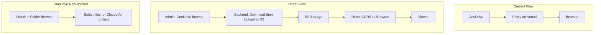

# R2 Migration and Viewer Upgrade Plan

> **Priority:** 9 (Case DICOM Viewer Upgrade)  
> **Complexity:** Medium-High  
> **Estimated Effort:** 3-4 weeks  
> **Status:** Planned  
> **Depends on:** Plan 7 (Case DICOM Viewer) – Implemented

---

## Executive Summary

Migrate case image stacks from OneDrive to Cloudflare R2, upgrade the DICOM viewer for smooth plan switching and session-long caching, and repurpose OneDrive for folder browsing to support Claude AI context. No batch migration script: admins delete existing OneDrive-linked stacks and re-add via new "Upload from OneDrive to R2" admin UI.

---

## Style and Branding Requirements

**All implementations MUST follow existing app design patterns.**

### Color Palette

| Name | Hex | Usage |
|------|-----|-------|
| Peachy Orange | `#e96304` | Primary buttons, accents, CTAs |
| Soft Green | `#a8d5ba` | Success states, secondary buttons |
| Teal Blue | `#5E899E` | Headers, neutral actions, nav |
| Info Blue | `#17a2b8` | Hints, explanations |
| Bootstrap Yellow | `#ffc107` | Warnings, highlights |
| Danger Red | `#dc3545` | Errors |

Text: Primary `#2c3e50`, Secondary `#5a6270`, Muted `#8b94a3`. Backgrounds: White `#ffffff`, Off-white `#fdfdfb`, Border `#c5cad1`.

### Fonts

Use app typography: `-apple-system`, `BlinkMacSystemFont`, `'Segoe UI'`, `Roboto`, sans-serif for body; monospace for code/notes where applicable.

### Modals

**Do not use Bootstrap modals where Vue modals are needed.** Use Vue-based modals for new modal dialogs; follow existing modal patterns in the app.

### Image Viewer

**Use the existing stack image viewer. Do not alter it.** Changes are limited to internal logic only (preload cancellation, Cornerstone cache size) in `viewer.js`. Do not modify the viewer component structure, UI, or layout.

### Branch and Version Control

- **All work MUST be done in a new feature branch** (e.g. `feature/r2-migration-viewer-upgrade`). Do not commit directly to `main`.
- **Commit and push reasonably** – small, logical commits with clear messages. Push frequently so work is backed up.
- **Preserve main** – Do not merge to `main` or overwrite the current state of the app in `main` unless explicitly confirmed by the project owner. The state of `main` must not be lost without confirmation.

---

## Architecture

---

## Part A: Cloudflare R2 Migration

### A.1 R2 Setup

- Create R2 bucket in Cloudflare dashboard
- Configure CORS for app origin (e.g. `https://your-app.vercel.app`, `http://localhost:5000`)
- Set Cache-Control headers for immutable URLs if using public access
- Store credentials: `R2_ACCOUNT_ID`, `R2_ACCESS_KEY_ID`, `R2_SECRET_ACCESS_KEY`, `R2_BUCKET_NAME`

### A.2 Data Model Changes

Add to `CaseImageStack` (migration):

| Column | Type | Purpose |
|--------|------|---------|
| `storage_backend` | VARCHAR | `'r2'` or `'onedrive'` (legacy, to be removed) |
| `r2_config_json` | JSON | `{ "axial": ["key1", "key2"], "sagittal": [...] }` – R2 object keys per plan |

For new R2-only stacks: `storage_backend = 'r2'`, `r2_config_json` holds object keys. Legacy OneDrive columns (`onedrive_share_id`, etc.) remain during transition but are no longer used for image display once migrated.

### A.3 Admin UI: Upload from OneDrive to R2

**Flow (no migration script):**

1. Admin in `edit_case` clicks "Add Image Stack" or "Upload from OneDrive"
2. OneDrive OAuth (if not connected)
3. Admin pastes OneDrive share link or browses folder
4. Backend lists folder contents via Graph API (plans: axial, sagittal, etc.)
5. Admin selects folder structure / confirms
6. Admin clicks "Upload to R2"
7. Backend: for each image file, download from OneDrive -> upload to R2
8. Backend: create/update `CaseImageStack` with `storage_backend='r2'`, `r2_config_json` containing R2 object keys
9. Done

**Existing OneDrive-linked cases:** Admin deletes the stack and re-adds via this flow. No batch migration script.

### A.4 URL Generation

| Option | Link Lifetime | User Access | Recommendation |
|--------|---------------|-------------|----------------|
| **Public** | No expiry | Same URL always | Use if URLs are non-guessable (e.g. random paths) |
| **Presigned** | 24-48h | New URL generated when user loads case | Use for private bucket; backend returns fresh URLs in stack API |

**Presigned flow:** When user opens a case, `GET /api/case/{id}/stack` returns image URLs. Backend generates presigned URLs (e.g. 48h) for each R2 object. User loads case -> gets fresh URLs. On next visit, same API call returns new presigned URLs. No expiry concern for normal usage.

### A.5 Remove Proxy and OneDrive Image Linking

- Remove `proxy_image` route
- Remove `imageStackProxyUrl()` in `view_case.html`
- Frontend uses direct R2 URLs (public or from stack API)
- Remove OneDrive-based stack save flow from `edit_case`; replace with "Upload to R2" flow

---

## Part B: Viewer Upgrades

**Constraint:** Do not alter the existing stack image viewer component or UI. Changes are internal logic only.

### B.1 Preload Cancellation on Plan Switch

When user switches plan (e.g. Axial -> Sagittal), stop loading images for the previous plan.

- Add `_preloadRunId` in `viewer.js`; increment on each `loadStack` / plan switch
- In `preloadFullStack()` and `preloadImages()`, capture runId at start; on completion, if `runId !== _preloadRunId`, ignore result
- Only the active plan's preload affects the UI

### B.2 Cornerstone Cache Size

- Call `cornerstone.imageLoader.imageCache.setMaximumSizeBytes(2 * 1024 * 1024 * 1024)` (2 GB) after Cornerstone init
- Enables session-long retention of multiple plans (e.g. 240 MB/case x several plans)

### B.3 Session Cache Retention

- Keep `_preloadedImages` global; do not clear on plan switch
- Only clear on `disable()` (viewer teardown)
- Returned-to plans use cached images when available

### B.4 Reduce Plan-Switch Delay

- Reduce or remove the 100ms delay before `preloadFullStack()` on plan switch (currently in `loadStack` setTimeout)
- Consider 0ms or 50ms to make plan switching feel more responsive

### B.5 Center-First Preload Order (Black Slice Heuristic)

- Preload from center outward: center slice first, then center±1, center±2, etc.
- Slices with actual anatomy (typically toward center) load before black/empty edge slices
- Improves perceived smoothness when scrolling through the stack

---

## Part C: OneDrive Repurposing

**Purpose change:** From image linking to folder browsing for AI context.

**Use case:** User browses OneDrive folders, selects files to provide to Claude AI for richer responses (guidelines, notes, study materials).

**Keep:**

- OAuth flow, token storage
- `onedrive_service.py`: `list_folder_contents`, share link parsing, file download

**Remove from image flow:**

- `CaseImageStack` no longer stores `onedrive_share_id` for serving images (R2 only)

**New (future, with AI/RAG plan):**

- OneDrive folder browser UI: list files, select files
- "Add to AI context" – backend fetches file content, passes to Claude API
- Integration with Plan 6 (AI/RAG Knowledge System)

---

## Part F: Bug Fixes and UX Improvements

### F.1 Image Stack Link Two-Attempt Save

**Issue:** Linking image stack sometimes requires two attempts; first attempt appears saved but nothing persists when case is saved.

**Cause:** For new cases, the flow redirects to view-case after case save. User leaves the edit page before they can link the stack. Stack linking only works on edit-case with a valid case ID.

**Fixes:**

- After creating a new case, redirect to `edit-case?id={newId}` instead of `view-case`, so the user can link the stack in the same session
- Or show a clear message after case creation: "Case saved. You can now link an Image Stack"

**Files:** `static/edit-case-modal.js` (redirect logic after case create)

### F.2 Plan Switching Delay

**Issue:** Noticeable delay when switching plans; downloads do not shift quickly to the new plan.

**Cause:** 100ms delay before preloadFullStack; first image of new plan must load before view updates; conservative batching (4 images, 150ms).

**Fixes:**

- Reduce or remove the 100ms delay before `preloadFullStack()` on plan switch (see B.4)
- Prioritize visible slice and nearby slices in preload order

### F.3 Center-First Preload (Black Slice Heuristic)

**Issue:** Black/empty slices (outside patient body) load with same priority as slices with actual anatomy.

**Fix:** Preload from center outward – center slice first, then center±1, center±2, etc. Slices with content load sooner (see B.5).

**Future (R2 migration):** Server-side analysis during upload to detect non-black slices; store metadata in `r2_config_json` for prioritized loading.

---

## Part D: Storage Strategy

| Storage | Purpose |
|---------|---------|
| **R2** | Case DICOM/image stacks only (100-500 MB/case, avg 240 MB) |
| **Cloudinary** | General app images (avatars, thumbnails, UI assets) – 250 GB free |
| **OneDrive** | Folder browse for AI context (documents, not images) |

---

## Part E: Implementation Phases

**Prerequisite:** Create feature branch `feature/r2-migration-viewer-upgrade` (or similar) from `main`. All work on the branch; do not merge to `main` without owner confirmation.

| Phase | Tasks | Est. |
|-------|-------|------|
| 1. Viewer upgrades | Preload runId, Cornerstone cache 2 GB, reduce plan-switch delay, center-first preload | 1-2 days |
| 1b. Bug fix | Image stack two-attempt save: redirect to edit-case after new case create | 0.5 day |
| 2. R2 infra | Bucket, CORS, credentials, boto3/R2 client | 0.5 day |
| 3. Backend R2 upload | Endpoint: parse OneDrive folder -> download -> upload to R2 -> save CaseImageStack | 2-3 days |
| 4. Admin UI | "Upload from OneDrive to R2" flow in edit_case (use Vue modals if modal needed, not Bootstrap) | 1-2 days |
| 5. Stack API + frontend | get_case_stack returns R2 URLs; remove proxy, use direct URLs | 1 day |
| 6. OneDrive cleanup | Remove image-linking from CaseImageStack save; keep OAuth + folder browse for future AI | 0.5 day |

**Total:** ~3-4 weeks

---

## Files Affected

| File | Change |
|------|--------|
| `case_dicom_viewer/routes.py` | Remove proxy_image; add R2 upload endpoint; get_case_stack returns R2 URLs |
| `case_dicom_viewer/r2_service.py` | New: R2 client, upload, presigned URL generation |
| `case_dicom_viewer/onedrive_service.py` | Keep; used for folder list + download during upload flow |
| `case_dicom_viewer/static/case_dicom_viewer/viewer.js` | Preload runId, cache config, plan-switch delay, center-first preload |
| `static/edit-case-modal.js` | Redirect to edit-case after new case create (fix two-attempt save) |
| `models.py` | CaseImageStack: storage_backend, r2_config_json |
| `templates/edit_case.html` | Replace OneDrive link modal with "Upload from OneDrive to R2" flow; use Vue modals where modals needed |
| `templates/view_case.html` | Remove imageStackProxyUrl; use direct R2 URLs from API |
| `migrations/` | Add storage_backend, r2_config_json columns |

---

## Success Criteria

- Case images served from R2 with no proxy (no Vercel Fast Origin Transfer for images)
- Admin can add/relink stacks via "Upload from OneDrive to R2"
- Smooth plan switching (no wasted downloads for inactive plan)
- Session cache retains loaded images across plan switches
- OneDrive OAuth and folder browse retained for future AI context feature
- Image stack links on first attempt (redirect to edit-case after new case create)
- Responsive plan switching with center-first preload

---

## Version History

| Date | Change |
|------|--------|
| 2026-02-02 | Initial plan; no migration script; admin UI only for OneDrive -> R2 upload |
| 2026-02-02 | Added style/branding requirements, color palette, fonts, Vue modals, no-alteration rule for image viewer |
| 2026-02-02 | Added branch/version control: work in feature branch, reasonable commits, preserve main unless confirmed |
| 2026-02-03 | Added Part F: Bug fixes (two-attempt save, plan-switch delay, center-first preload); B.4, B.5; Phase 1b |
