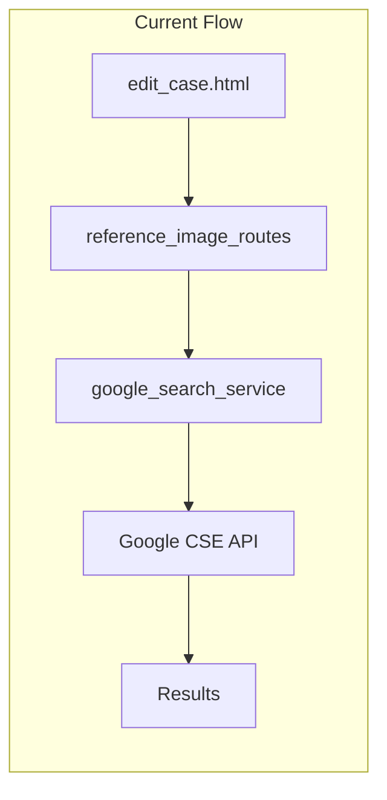
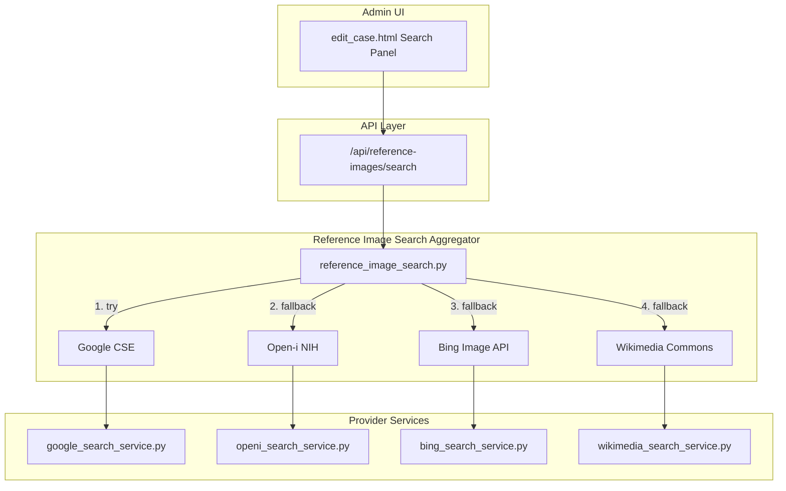

# Reference Image: Beyond Google - Planning Document

## Objective

Keep the current Google Custom Search workflow as primary, and add alternative search providers (Open-i, Bing, Wikimedia Commons) so admins can find CC-licensed radiology images even when Google API is unavailable or returns no results.

---

## Current Architecture



**Key files:**
- [reference_image_routes.py](../reference_image_routes.py) – `/api/reference-images/search` calls `search_reference_images()`
- [google_search_service.py](../google_search_service.py) – `search_images()`, `search_reference_images()`, `build_search_queries()`, `build_manual_search_url()`
- [templates/edit_case.html](../templates/edit_case.html) – Reference image search panel

---

## Proposed Architecture



---

## Provider Summary

| Provider | Cost | CC Filter | Radiology Fit | API |
|----------|------|-----------|---------------|-----|
| **Google CSE** | Paid (quota) | `rights` param | General web | Existing |
| **Open-i (NIH)** | Free | Open-access literature | High | `https://openi.nlm.nih.gov/api` |
| **Bing Image** | Paid (free tier) | `license` param | General web | Azure Cognitive Services |
| **Wikimedia Commons** | Free | CC by design | Anatomy diagrams | MediaWiki API |

---

## Implementation Plan

### Phase 1: Provider Interface and Aggregator

1. **Create provider interface** – Define a common interface that all providers implement: `search(query, image_type, max_results) -> list[dict]`
2. **Create aggregator** (`reference_image_search.py`) – Accepts same params as `search_reference_images()`, tries providers in order, merges and deduplicates. Configurable via `REFERENCE_IMAGE_SEARCH_PROVIDERS`.

### Phase 2: Provider Implementations

1. **Open-i service** (`openi_search_service.py`) – GET `/api/search`, license filter `lic=by`, no API key
2. **Bing Image service** (`bing_search_service.py`) – Requires `BING_IMAGE_SEARCH_KEY`, license filter for CC
3. **Wikimedia Commons service** (`wikimedia_search_service.py`) – MediaWiki API, File namespace search, no API key

### Phase 3: Integration

1. **Update reference_image_routes** – Replace direct `search_reference_images()` with aggregator, preserve `manual_search_url` fallback
2. **Admin UI** – Keep unchanged; rely on automatic fallback

### Phase 4: Configuration and Env

Add to `.env.example`:
```
REFERENCE_IMAGE_SEARCH_PROVIDERS=google,openi,commons
BING_IMAGE_SEARCH_KEY=
```

---

## Post-Implementation Checklist

**TODO (when applicable):**

- [ ] **Backup routes:** If `search_source` (or any new column) is added to `CaseReferenceImage`, update [backup_routes.py](../backup_routes.py) (export, import, stats)
- [ ] **Migrations:** If schema changes, run on both:
  - Local: `python scripts/utilities/run_migration.py`
  - Neon: `vercel env pull .env.vercel --environment=production` then `python scripts/utilities/run_migration.py`
- [ ] **Standalone SQL:** Update `migrations/add_*.sql` for Neon if not using Alembic

*Note: Current implementation does not add schema changes; no backup or migration updates required.*

---

## Dependencies

- `requests` (already present)
- No new DB models if `search_source` is skipped
- Open-i and Wikimedia: no API keys
- Bing: Azure Cognitive Services subscription for production use
